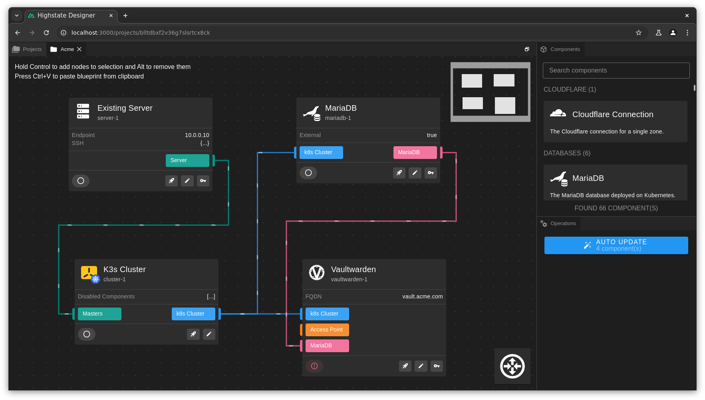

# The Highstate Project

Highstate is a visual infrastructure orchestration platform built on top of Pulumi.

- [Main Documentation](https://highstate.io)
- [Contributing Guide](CONTRIBUTING.md)

## License

The whole content of this repository is licensed under the [MIT License](LICENSE).

Some standard infrastructure components may package third-party software with their own licenses.
Highstate does not include any third-party code or content in its distribution.
It rather reference them via URLs and include their hashes to ensure the integrity of the referenced content.
