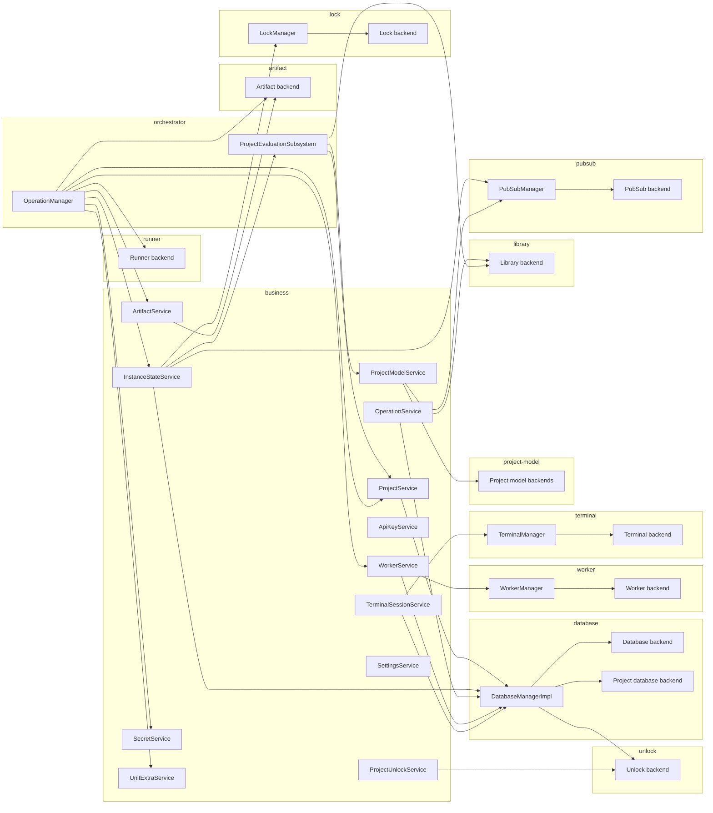

# Backend Architecture

The backend package orchestrates Highstate's stateful services.
It runs evaluations, deployments, artifact storage, secrets, workers, and terminals, and it feeds higher-level APIs implemented by sibling packages such as `@highstate/designer` (tRPC/HTTP) and `@highstate/backend-api` (gRPC).
This note provides the architectural map contributors need when evolving the backend.

## Purpose and public surface

- Provide a long-lived runtime that owns encrypted project state, orchestrates Pulumi operations, and supervises background workloads.
- Offer cohesive business services that UI layers and CLIs can consume without binding them to a transport.
- Support pluggable adapters so storage, execution, and coordination layers can be swapped per environment.
- Expose a single entry point, `getSharedServices`, which lazily instantiates (and caches) the backend runtime via `createServices`.

## Runtime flow

1. **Configuration:** [`config.ts`][backend-config] merges adapter settings, logging flags, and shared codebase options.
2. **Assembly:** [`createServices`][create-services] builds adapters, managers, business services, and orchestrators, returning a typed `Services` container.
3. **Consumption:** Designer routes, CLI commands, and gRPC handlers (defined outside this package) call `getSharedServices` to resolve dependencies and pair them with transport logic.
4. **Shutdown:** `disposeServices` walks the container and disposes any adapter or manager that implements `Symbol.dispose`/`Symbol.asyncDispose`.

## Architecture map

Edges point from each component to the dependencies it requires.

## Subsystems

### Adapter subsystem

Each adapter folder (`artifact/`, `database/`, `library/`, `lock/`, `pubsub/`, `runner/`, `terminal/`, `unlock/`, `worker/`, `project-model/`) bundles environment-specific integrations with any thin helper classes that sit directly on top of them.
Factory functions such as [`createBackendDatabaseBackend`][database-factory], [`createArtifactBackend`][artifact-factory], and [`createRunnerBackend`][runner-factory] pick implementations from configuration, while helpers like [`DatabaseManagerImpl`][database-manager], [`LockManager`][lock-manager], [`PubSubManager`][pubsub-manager], [`WorkerManager`][worker-manager], and [`TerminalManager`][terminal-manager] add caching, lifecycle, or batching but stay within the same folders.
Adapters purposely avoid domain rules so that swapping them is the main lever for targeting new infrastructure.

### Business subsystem

Business services implement the backend's domain semantics: project lifecycles, instance state, artifacts, secrets, settings, workers, and terminals.
They depend on adapter layers but present transport-neutral APIs ideal for tRPC, REST, or gRPC consumers.
Key roles include:

- [`ProjectUnlockService`][project-unlock-service] owns project master keys, schedules unlock tasks, and synchronises encrypted state.
- [`ProjectService`][project-service] creates projects, ensures databases are ready, and coordinates with evaluation/orchestration layers.
- [`ProjectModelService`][project-model-service] abstracts codebase versus database storage while keeping model state consistent after unlock.
- [`InstanceStateService`][instance-state-service] persists instance statuses, operation history, and unit-derived metadata, publishing pubsub events for UIs.
- [`ArtifactService`][artifact-service] deduplicates uploads, maintains references, and triggers garbage collection when artifacts lose consumers.
- [`SecretService`][secret-service] validates secrets against component schemas and rotates input hash nonces to drive deterministic deploys.
- [`OperationService`][operation-service], [`WorkerService`][worker-service], [`TerminalSessionService`][terminal-session-service], [`ApiKeyService`][api-key-service], [`SettingsService`][settings-service], and [`UnitExtraService`][unit-extra-service] handle their respective slices of persisted state.

Business services are stateful, transaction-aware, and intentionally verbose because they encode Highstate's behaviour, not infrastructure glue.

### Orchestrator subsystem

Two orchestrators coordinate long-running workflows and glue multiple services together:

- [`ProjectEvaluationSubsystem`][evaluation-subsystem] watches unlock events, resolves project graphs via [`InputResolver`][input-resolver], evaluates composites with the library backend, and persists virtual instances.
- [`OperationManager`][operation-manager] plans and runs update/destroy/refresh operations by composing the runner backend, instance state, artifact service, secrets, locks, and workers.

Both subsystems register unlock tasks so they resume gracefully after restarts without data loss.

### Support modules

- `common/` hosts utilities such as path resolution, logging helpers, and retry wrappers shared across subsystems.
- `shared/` defines schema types, resolver helpers, and event payload shapes consumed by business and orchestrator code.
- Root files (`config.ts`, `services.ts`, `index.ts`) glue configuration, service composition, and re-exports together.

## Adapter summary

| Adapter          | Factory                                               | Default implementation                                                                                           | Role                                                          |
| ---------------- | ----------------------------------------------------- | ---------------------------------------------------------------------------------------------------------------- | ------------------------------------------------------------- |
| Database         | [`createBackendDatabaseBackend`][database-factory]    | [`createLocalBackendDatabaseBackend`][database-local-backend]                                                    | Global metadata storage (LibSQL)                              |
| Project database | [`createProjectDatabaseBackend`][database-factory]    | [`LocalProjectDatabaseBackend`][database-local-project]                                                          | Per-project encrypted SQLite databases                        |
| Artifact         | [`createArtifactBackend`][artifact-factory]           | [`LocalArtifactBackend`][artifact-local] + [`EncryptionArtifactBackend`][artifact-encryption]                    | Artifact blob storage with optional encryption                |
| Unlock           | (direct)                                              | [`MemoryProjectUnlockBackend`][unlock-memory]                                                                    | Holds decrypted master keys in memory                         |
| Project model    | [`createProjectModelBackends`][project-model-factory] | [`CodebaseProjectModelBackend`][project-model-codebase], [`DatabaseProjectModelBackend`][project-model-database] | Stores project blueprints (YAML or database)                  |
| Library          | (direct)                                              | [`LocalLibraryBackend`][library-local]                                                                           | Watches packages, evaluates composites, resolves unit sources |
| Runner           | [`createRunnerBackend`][runner-factory]               | [`LocalRunnerBackend`][runner-local]                                                                             | Executes Pulumi programs and streams updates                  |
| Worker           | [`createWorkerBackend`][worker-factory]               | [`DockerWorkerBackend`][worker-docker]                                                                           | Runs background worker containers                             |
| Terminal         | [`createTerminalBackend`][terminal-factory]           | [`DockerTerminalBackend`][terminal-docker]                                                                       | Hosts interactive shells                                      |
| PubSub           | [`createPubSubBackend`][pubsub-factory]               | [`MemoryPubSubBackend`][pubsub-memory]                                                                           | In-process event bus                                          |
| Lock             | [`createLockBackend`][lock-factory]                   | [`MemoryLockBackend`][lock-memory]                                                                               | Async critical section coordination                           |

The local backend database backend also seeds an unlock method for the machine that created the database. It labels the entry using the host name (or `initial` when unavailable) and marks the description so operators know it was generated automatically before adding additional recipients.

## See also

- [Resolution engine](RESOLUTION_ENGINE.md) for resolver design shared by evaluations and operations.
- [Evaluation engine](EVALUATION_ENGINE.md) for composite execution internals.

[backend-config]: ../packages/platform/backend/src/config.ts
[create-services]: ../packages/platform/backend/src/services.ts
[database-factory]: ../packages/platform/backend/src/database/factory.ts
[runner-factory]: ../packages/platform/backend/src/runner/factory.ts
[database-local-backend]: ../packages/platform/backend/src/database/local/backend.ts
[database-local-project]: ../packages/platform/backend/src/database/local/project.ts
[database-manager]: ../packages/platform/backend/src/database/manager.ts
[artifact-factory]: ../packages/platform/backend/src/artifact/factory.ts
[artifact-local]: ../packages/platform/backend/src/artifact/local.ts
[artifact-encryption]: ../packages/platform/backend/src/artifact/encryption.ts
[project-model-factory]: ../packages/platform/backend/src/project-model/factory.ts
[project-model-codebase]: ../packages/platform/backend/src/project-model/backends/codebase.ts
[project-model-database]: ../packages/platform/backend/src/project-model/backends/database.ts
[library-local]: ../packages/platform/backend/src/library/local.ts
[runner-local]: ../packages/platform/backend/src/runner/local.ts
[unlock-memory]: ../packages/platform/backend/src/unlock/memory.ts
[artifact-service]: ../packages/platform/backend/src/business/artifact.ts
[secret-service]: ../packages/platform/backend/src/business/secret.ts
[project-model-service]: ../packages/platform/backend/src/business/project-model.ts
[input-resolver]: ../packages/platform/backend/src/shared/resolvers/input.ts
[evaluation-subsystem]: ../packages/platform/backend/src/business/evaluation.ts
[operation-manager]: ../packages/platform/backend/src/orchestrator/manager.ts
[operation-context]: ../packages/platform/backend/src/orchestrator/operation-context.ts
[project-service]: ../packages/platform/backend/src/business/project.ts
[project-unlock-service]: ../packages/platform/backend/src/business/project-unlock.ts
[instance-state-service]: ../packages/platform/backend/src/business/instance-state.ts
[operation-service]: ../packages/platform/backend/src/business/operation.ts
[worker-service]: ../packages/platform/backend/src/business/worker.ts
[terminal-session-service]: ../packages/platform/backend/src/business/terminal-session.ts
[api-key-service]: ../packages/platform/backend/src/business/api-key.ts
[settings-service]: ../packages/platform/backend/src/business/settings.ts
[unit-extra-service]: ../packages/platform/backend/src/business/unit-extra.ts
[worker-manager]: ../packages/platform/backend/src/worker/manager.ts
[terminal-manager]: ../packages/platform/backend/src/terminal/manager.ts
[pubsub-manager]: ../packages/platform/backend/src/pubsub/manager.ts
[lock-manager]: ../packages/platform/backend/src/lock/manager.ts
[pubsub-factory]: ../packages/platform/backend/src/pubsub/factory.ts
[pubsub-memory]: ../packages/platform/backend/src/pubsub/memory.ts
[lock-factory]: ../packages/platform/backend/src/lock/factory.ts
[lock-memory]: ../packages/platform/backend/src/lock/memory.ts
[worker-factory]: ../packages/platform/backend/src/worker/factory.ts
[worker-docker]: ../packages/platform/backend/src/worker/docker.ts
[terminal-factory]: ../packages/platform/backend/src/terminal/factory.ts
[terminal-docker]: ../packages/platform/backend/src/terminal/docker.ts
