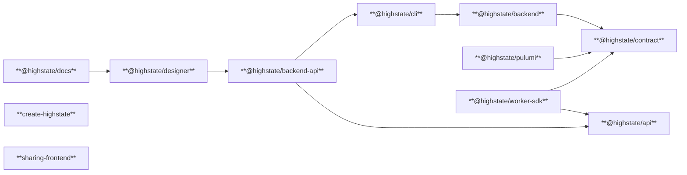
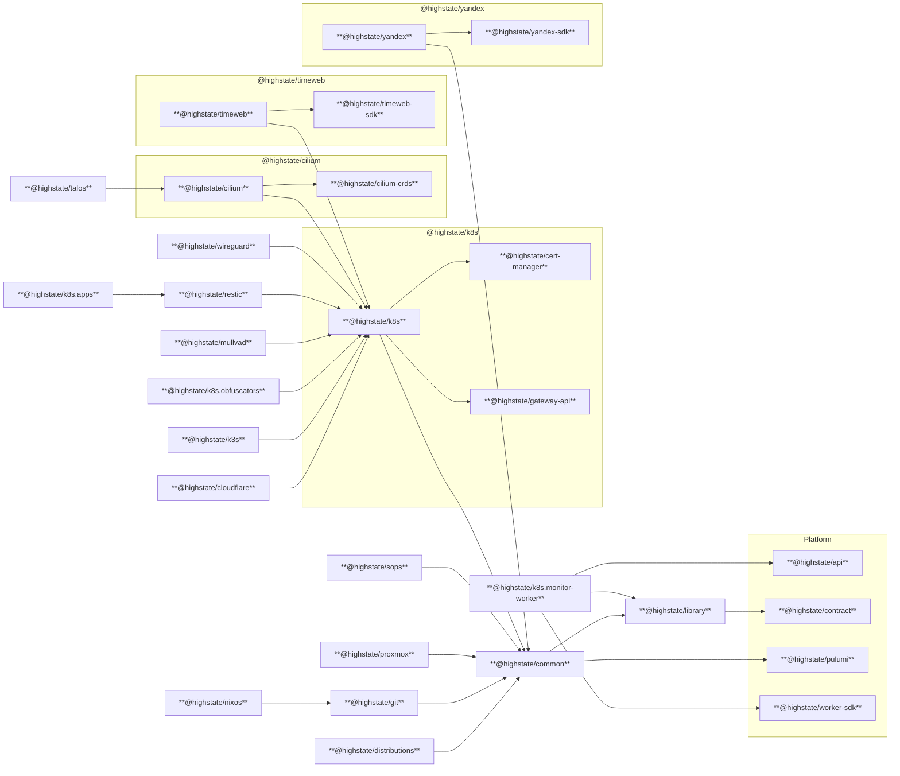

# Overview

This document is intended to help new contributors to get started with the Highstate codebase.
If you want just to use Highstate, please refer to [the main documentation](https://highstate.io).

### Tech stack

- [TypeScript](https://www.typescriptlang.org/) everywhere
- [Node.js](https://nodejs.org/) + [pnpm](https://pnpm.io/)
- [Lerna](https://lerna.js.org/) + [Nx](https://nx.dev/)
- [Pulumi](https://www.pulumi.com/)
- [Prisma ORM](https://www.prisma.io/)
- [Nuxt 4](https://nuxt.com/)
- [tRPC](https://trpc.io/) for internal APIs
- [gRPC](https://grpc.io/) for public APIs
- [Vitest](https://vitest.dev/) for testing
- [Biome](https://biomejs.dev/) for linting and formatting
- [Docker](https://www.docker.com/)
- [devenv](https://devenv.sh/) and [Nix](https://nixos.org/) for development environment
- other tools as needed (kubectl, Helm, etc.)

## Environment setup

### Using devenv

The recommended workflow is to rely on `devenv`, which provisions Node.js, Pulumi, Prisma and oher utilities as specified in `devenv.nix`.
Run `devenv shell` at the repository root to enter the prepared environment or setup `direnv` extension in VSCode or other editors to get shell without manual steps.

### Manual setup

When configuring the environment manually:

- Install Node.js 24 and enable Corepack.
- Install Pulumi CLI, Terraform, kubectl, Helm, and other tooling referenced in `devenv.nix`.
- Ensure Docker is available.

## Packages

Highstate separates packages into three groups to keep responsibilities clear:

- **Platform:** Core services, developer tooling, and user-facing applications that remain infrastructure-agnostic.
- **Standard:** The standard library of components and entities covering common use cases and foundational technologies.
- **Third-party:** Vendor-specific extensions of the standard library that integrate external providers. Also the part of the STL.

### Platform

<!-- DEPENDENCY_GRAPH_START: packages/platform -->

<!-- DEPENDENCY_GRAPH_END -->

**The diagram was generated by `pnpm update-diagrams`. Transitive dependencies are omitted for clarity.**

- `@highstate/contract`: Canonical type system describing components, units, and entities across the ecosystem.
- `@highstate/pulumi`: Utilities that translate Highstate contracts into Pulumi programs for provisioning.
- `@highstate/backend`: Orchestrator service that persists projects, schedules operations, and exposes domain logic for other platform components.
- `@highstate/designer`: Nuxt application providing the visual canvas; it talks to `@highstate/backend` directly and mounts backend API endpoints alongside its tRPC routes.
- `@highstate/cli`: Command-line entry point that drives workspace lifecycle tasks using backend services and shared contracts.
- `@highstate/api`: Protobuf schemas and generated gRPC clients for worker and backend communication surfaces.
- `@highstate/backend-api`: gRPC façade built on the backend service, consumed by workers and tooling for remote execution.
- `@highstate/worker-sdk`: gRPC SDK for background workers generated from the API contracts.
- `@highstate/docs`: Nuxt Content documentation site with Docker image build and publish targets.

### Standard Library

<!-- DEPENDENCY_GRAPH_START: packages/standard, packages/third-party -->

<!-- DEPENDENCY_GRAPH_END -->

**The diagram was generated by `pnpm update-diagrams`. Transitive dependencies are omitted for clarity.**

- `@highstate/library`: Defines the component and entity schemas for the standard library, covering domains such as common hosts, networks, Kubernetes, storage, and vendor-specific extensions.
- `@highstate/common`: Supplies reusable building blocks for real servers, SSH access, remote files, scripted actions, network endpoints, DNS management, and database connectors.
- `@highstate/cilium`: Ships the Cilium Helm chart metadata and implements network policy support through the generated Cilium CRDs.
- `@highstate/distributions`: Exposes curated operating system image descriptors (like Ubuntu) with ISO urls, checksums and starter cloud-config templates.
- `@highstate/git`: Clones remote repositories and materializes them into artifacts that can be referenced by other components.
- `@highstate/k3s`: Installs multi-node K3s clusters by streaming configuration to servers, running the installer scripts, and returning kubeconfig plus connection endpoints.
- `@highstate/k8s`: Offers comprehensive Kubernetes primitives: workload helpers, RBAC utilities, Helm rendering, CRD wrappers, and network policy tooling.
- `@highstate/k8s.apps`: Delivers ready-to-run workloads (Traefik, PostgreSQL, Vaultwarden, Syncthing, and more) built on the shared Kubernetes helpers with optional Restic hooks.
- `@highstate/k8s.monitor-worker`: Implements the Kubernetes monitor worker that watches cluster resources via informers and reports status through the worker SDK.
- `@highstate/k8s.obfuscators`: Deploys Phantun-powered UDP disguises and related services to hide cluster entrypoints behind obfuscated proxies.
- `@highstate/nixos`: Builds inline flakes or modules and applies them to hosts using `nixos-anywhere`, then exposes SSH access for follow-up work.
- `@highstate/proxmox`: Creates Proxmox virtual machines, prepares cloud-init snippets, seeds credentials, and returns the resulting server bundle.
- `@highstate/restic`: Generates Kubernetes jobs and cronjobs that perform Restic backups, provisioning secrets and script bundles for restores.
- `@highstate/sops`: Encrypts structured secret payloads with SOPS by deriving age recipients from the target servers.
- `@highstate/talos`: Produces Talos cluster configurations, applies them to masters and workers, and inlines Cilium or storage manifests when requested.
- `@highstate/wireguard`: Manages WireGuard networks, identities, peers, and optional Kubernetes-side daemons for transport nodes.

There are also several non-essential packages:

- `@highstate/example`: Houses the demo workspace used for tutorials and designer smoke tests.
- `@highstate/example.library`: Implements teaching-focused component definitions that show how to extend the standard library.
- `@highstate/example.units`: Provides hands-on example units (such as the cowsay demo) that use the example library stack.

## Generated packages

Some packages are entirely generated using different tools and scripts. The are three kinds of such packages:

#### 1. Pulumi wrappers over Kubernetes CRDs

The common code for their generation is defined in `scripts/shared.sh`
and scripts to generate each package are located in `scripts` of "owning" packages.

For now, there are only two such packages:

- `@highstate/k8s` which generates `@highstate/cert-manager` and `@highstate/gateway-api`.
- `@highstate/cilium` which generates `@highstate/cilium-crds`.

The generation in these packages should be triggered by `pnpm generate-crds` command.

#### 2. Pulumi wrappers for Terraform providers

The `scripts/shared.sh` defines `generate_terraform_sdks` function
which can be used by packages to generate Pulumi SDKs for Terraform providers.

The following packages use it:

- `@highstate/nixos`
- `@highstate/timeweb`
- `@highstate/yandex`

The generation in these packages should be triggered by `pnpm generate-sdks` command.

#### 3. gRPC clients and servers

The `@highstate/api` package contains Protobuf definitions for gRPC services and messages.
It generates TypeScript clients and server stubs using `ts-proto` plugin.

The generation in this package should be triggered by `pnpm generate-sdk` command.

## Third-party content

There are also several third-party things like docker images, Helm charts, etc.
They are not included in the repo, but rather referenced in files like `assets/images.json` or `assets/charts.json`
and updated by `scripts/update-images.sh` and `scripts/update-charts.sh` scripts.
Such files reference the URLs of the third-party content and their checksums.
Such content is downloaded at the user's machine (or its server/cluster) when needed.
