# Project Lifecycle

Highstate separates authored desired state, evaluated desired state, and deployed historical state.
That separation allows composites to expand into independently managed units and lets removed virtual
instances be destroyed safely.

## Model States

Resident instances and hubs are the authored project model.
Composite evaluation produces virtual child instances with resolved wiring.
A ghost is a deployed virtual instance that no longer appears in the current evaluation result.
Ghosts are historical operational state awaiting cleanup, not desired state.

The lifecycle is:

```mermaid
flowchart LR
    resident[Resident project model] --> resolution[Input resolution]
    resolution --> evaluation[Composite evaluation]
    evaluation --> virtual[Persisted virtual instances]
    virtual --> ghosts[Ghost detection]
    ghosts --> context[Operation context]
    context --> plan[Operation plan]
    plan --> pulumi[Pulumi execution]
    pulumi --> state[Persisted state and outputs]
```

Evaluation begins with the resident model.
Operation context later merges resident, persisted virtual, and ghost models, and can use historical models to
destroy resources that no longer exist in desired state.

## Evaluation

Input resolution prepares the resident graph before composite code executes in a worker thread.
Composite registration captures generated parent-child structure, resolved inputs, and outputs.
Generated instance IDs are unique across the project.
A duplicate ID invalidates the evaluation because later persistence and planning could not identify one owner.

Ordinary composite failures can remain isolated to an affected branch while independent branches report their
own results.
Worker crashes, timeouts, and library loading failures are system failures and invalidate the evaluation run.
The backend persists virtual models and evaluation status because operation planning depends on that result.

Model mutations request reevaluation, but the current architecture does not promise a transactional barrier
from every edit through evaluation to a newly started operation.
An asynchronous evaluation request and operation launch do not form one transaction for clients.

The evaluation subsystem, worker evaluator, contract evaluation helpers, and project-model service own exact
error and persistence behavior.

## Resolution And Planning

Resolution traverses dependencies before their dependents and records both directions for targeted
invalidation.
Evaluation and operation planning are separate resolver passes even when they share graph semantics.

An operation context combines the current models, library definitions, implementation sources, entity
snapshots, secrets, and persisted state.
Its hashes include model identity, component definitions, arguments, secret nonces, unit source, and dependency
information.
Separate dependency-output information permits a runtime no-op when an upstream implementation changed but
its effective outputs did not.

Planning computes closure across explicit targets, dependencies, dependents, composite relationships, and
ghosts before execution.
Updates follow dependency order; destruction follows the reverse order.
The Protobuf operation contract and planner source own the exact option matrix.

## Execution And Recovery

An operation persists its plan and per-instance state, then acquires locks progressively so independent graph
branches can proceed.
It is not a transaction across every unit: completed Pulumi work may remain after a later branch fails.
Finalization persists logs, state, snapshots, artifacts, secrets, outputs, and failure information before
releasing ownership.

A backend restart cannot continue an in-flight Pulumi call.
Unlock and recovery tasks repair persisted state, release stale ownership, and mark interrupted work failed
rather than pretending execution resumed.
Retries therefore operate on potentially partial execution rather than a transactionally rolled-back state.
