# Destroy Phase Examples

**Legend:**

- `✅` = Deployed instance
- `🚀` = Explicitly requested instance
- `👻` = Ghost instance (virtual)

### Example 1: Simple Dependency Chain

**Test**: `should include all dependents in linear chain when destroyDependentInstances enabled`

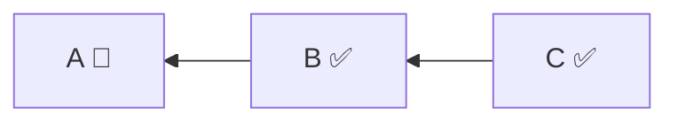
```mermaid
graph RL
    A["A 🚀"]
    B["B ✅"]
    C["C ✅"]

    C --> B --> A
```

**Options:**

- `destroyDependentInstances`: `true` **(default)**

**Decision Steps**:

1. `A` explicitly requested;
2. `B` depends on `A`, cascade enabled → `B` included (dependent of `A`);
3. `C` depends on `B`, cascade enabled → `C` included (dependent of `B`).

**Destroy Phase**: `C`, `B`, `A`

### Example 2: Simple Dependency Chain with Cascade Disabled

**Test**: `should not include dependents in linear chain when destroyDependentInstances disabled`

```mermaid
graph RL
    A["A 🚀"]
    B["B ✅"]
    C["C ✅"]

    C --> B --> A
```

**Options:**

- `destroyDependentInstances`: `false`

**Decision Steps**:

1. `A` explicitly requested;
2. `B` depends on `A`, cascade disabled → `B` excluded;
3. `C` depends on `B`, cascade disabled → `C` excluded.

**Destroy Phase**: `A`

### Example 3: Simple Dependency Chain - Middle Node Requested

**Test**: `should include all dependents when middle node requested with destroyDependentInstances enabled`

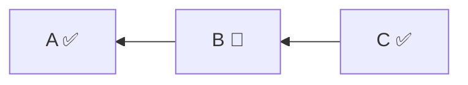
```mermaid
graph RL
    A["A ✅"]
    B["B 🚀"]
    C["C ✅"]

    C --> B --> A
```

**Decision Steps**:

1. `B` explicitly requested;
2. `C` depends on `B`, cascade enabled → `C` included (dependent of `B`);
3. `A` does not depend on `B` → `A` excluded.

**Destroy Phase**: `C`, `B`

### Example 4: Full Ancestor Chain for Compositional Inclusion

**Test**: `should include full ancestor chain for compositional inclusion`

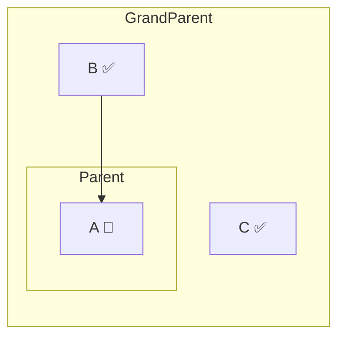
```mermaid
graph RL
    subgraph GrandParent
        subgraph Parent
            A["A 🚀"]
        end
        B["B ✅"]
        C["C ✅"]
    end

    B --> A
```

**Decision Steps**:

1. `A` explicitly requested;
2. `B` depends on `A`, cascade enabled → `B` included (dependent of `A`);
3. `A` is child of `Parent` → `Parent` included (compositional);
4. `Parent` is child of `GrandParent` → `GrandParent` included as ancestor;
5. `C` is sibling of `Parent`, but ancestor inclusion does not auto-include siblings → `C` NOT included.

**Destroy Phase**: `B`, `A`, `Parent`, `GrandParent`

### Example 5: Substantive Composite with Mixed Child States

**Test**: `should include all children of substantive composite`

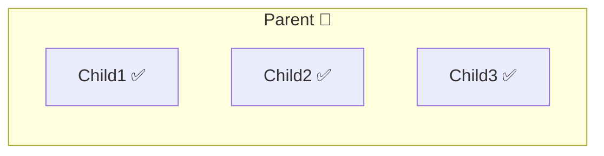
```mermaid
graph RL
    subgraph Parent["Parent 🚀"]
        Child1["Child1 ✅"]
        Child2["Child2 ✅"]
        Child3["Child3 ✅"]
    end
```

**Decision Steps**:

1. `Parent` explicitly requested (substantive composite);
2. `Child1` is child of substantive composite → `Child1` included;
3. `Child2` is child of substantive composite → `Child2` included;
4. `Child3` is child of substantive composite → `Child3` included.

**Destroy Phase**: `Child1`, `Child2`, `Child3`, `Parent`

### Example 6: Nested Composites with Dependencies

**Test**: `should handle complex nested hierarchy with dependencies`

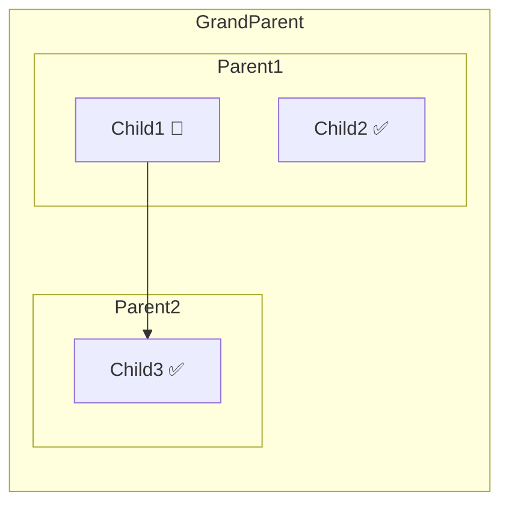
```mermaid
graph RL
    subgraph GrandParent
        subgraph Parent1
            Child1["Child1 🚀"]
            Child2["Child2 ✅"]
        end
        subgraph Parent2
            Child3["Child3 ✅"]
        end
    end

    Child1 --> Child3
```

**Decision Steps**:

1. `Child1` explicitly requested;
2. No instances depend on `Child1` (Child1 depends on Child3, not vice versa);
3. `Child1` is child of `Parent1` → `Parent1` included (compositional);
4. `Parent1` is child of `GrandParent` → `GrandParent` included as ancestor.

**Destroy Phase**: `Child1`, `Parent1`, `GrandParent`

### Example 7: Request Child with Isolated Destroy

**Test**: `should not include siblings when child explicitly requested`

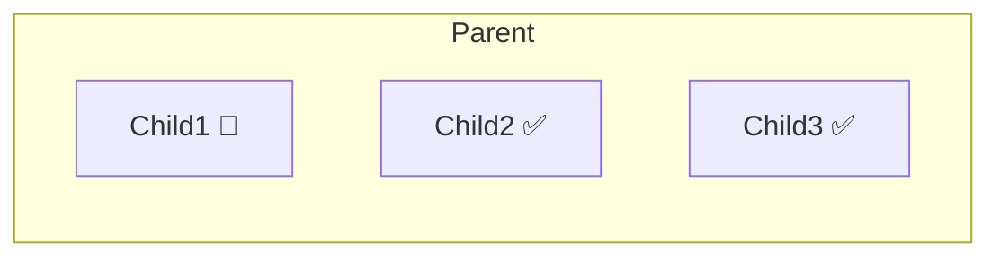
```mermaid
graph RL
    subgraph Parent
        Child1["Child1 🚀"]
        Child2["Child2 ✅"]
        Child3["Child3 ✅"]
    end
```

**Decision Steps**:

1. `Child1` explicitly requested;
2. No instances depend on `Child1`;
3. `Child1` is child of `Parent` → `Parent` included (compositional);
4. `Child2` and `Child3` are siblings but not affected → excluded.

**Destroy Phase**: `Child1`, `Parent`

### Example 8: Cross-Composite Dependencies

**Test**: `should handle dependencies crossing composite boundaries`

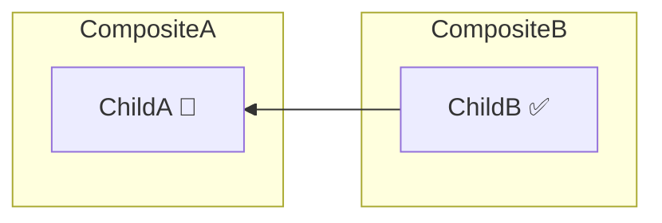
```mermaid
graph RL
    subgraph CompositeA
        ChildA["ChildA 🚀"]
    end
    subgraph CompositeB
        ChildB["ChildB ✅"]
    end

    ChildB --> ChildA
```

**Decision Steps**:

1. `ChildA` explicitly requested;
2. `ChildB` depends on `ChildA`, cascade enabled → `ChildB` included (dependent of `ChildA`);
3. `ChildA` is child of `CompositeA` → `CompositeA` included (compositional);
4. `ChildB` is child of `CompositeB`, included due to external dependency → `CompositeB` included (substantive).

**Destroy Phase**: `ChildB`, `CompositeB`, `ChildA`, `CompositeA`

### Example 9: Unrelated Instance Isolation

**Test**: `should not include unrelated instances that don't depend on destroyed instance`

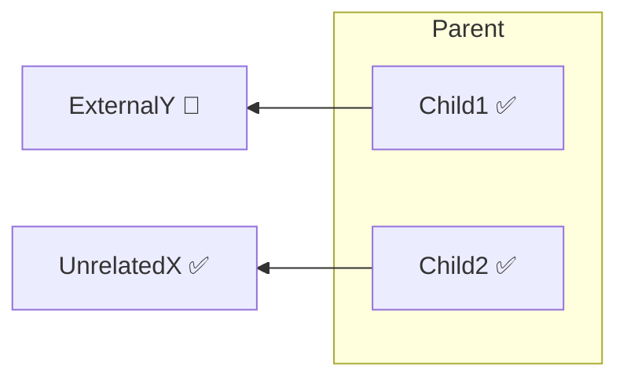
```mermaid
graph RL
    subgraph Parent
        Child1["Child1 ✅"]
        Child2["Child2 ✅"]
    end
    UnrelatedX["UnrelatedX ✅"]
    ExternalY["ExternalY 🚀"]

    Child1 --> ExternalY
    Child2 --> UnrelatedX
```

**Decision Steps**:

1. `ExternalY` explicitly requested;
2. `Child1` depends on `ExternalY`, cascade enabled → `Child1` included (dependent of `ExternalY`);
3. `Child1` is child of `Parent`, included due to external dependency → `Parent` becomes substantive;
4. `Child2` is child of substantive composite → `Child2` included;
5. `UnrelatedX` does not depend on any destroyed instance → `UnrelatedX` excluded.

**Destroy Phase**: `Child1`, `Child2`, `Parent`, `ExternalY`

### Example 10: Multiple Explicit Requests

**Test**: `should handle multiple explicit requests with overlapping dependencies`

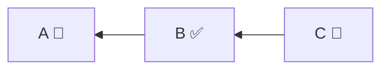
```mermaid
graph RL
    A["A 🚀"]
    B["B ✅"]
    C["C 🚀"]

    C --> B --> A
```

**Decision Steps**:

1. `A` explicitly requested;
2. `C` explicitly requested;
3. `B` depends on `A`, cascade enabled → `B` included (dependent of `A`);
4. `C` depends on `B`, `B` already included → no additional change.

**Destroy Phase**: `C`, `B`, `A`

### Example 11: Deep Nesting with Ancestor Chain Inclusion

**Test**: `should include deep ancestor chain without ancestor siblings`

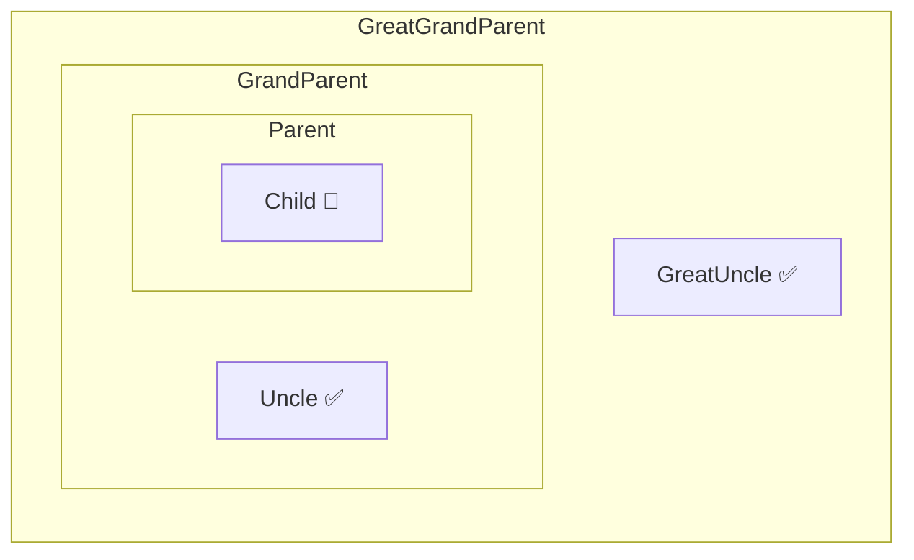
```mermaid
graph RL
    subgraph GreatGrandParent
        subgraph GrandParent
            subgraph Parent
                Child["Child 🚀"]
            end
            Uncle["Uncle ✅"]
        end
        GreatUncle["GreatUncle ✅"]
    end
```

**Decision Steps**:

1. `Child` explicitly requested;
2. No instances depend on `Child`;
3. `Child` is child of `Parent` → `Parent` included (compositional);
4. `Parent` is child of `GrandParent` → `GrandParent` included as ancestor;
5. `GrandParent` is child of `GreatGrandParent` → `GreatGrandParent` included as ancestor;
6. `Uncle` and `GreatUncle` are ancestor siblings and are not auto-included.

**Destroy Phase**: `Child`, `Parent`, `GrandParent`, `GreatGrandParent`

### Example 12: Diamond Dependency Pattern

**Test**: `should handle diamond dependency correctly`

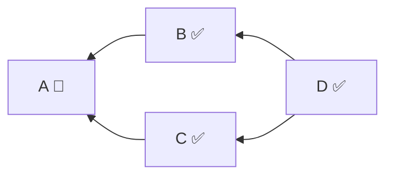
```mermaid
graph RL
    A["A 🚀"]
    B["B ✅"]
    C["C ✅"]
    D["D ✅"]

    D --> B
    D --> C
    B --> A
    C --> A
```

**Decision Steps**:

1. `A` explicitly requested;
2. `B` depends on `A`, cascade enabled → `B` included (dependent of `A`);
3. `C` depends on `A`, cascade enabled → `C` included (dependent of `A`);
4. `D` depends on `B`, cascade enabled → `D` included (dependent of `B`);
5. `D` also depends on `C`, already included → no additional change.

**Destroy Phase**: `D`, `B`, `C`, `A`

### Example 13: Dependency Chain with Partial Destruction Disabled

**Test**: `should include dependency chain and force siblings when partial destruction disabled`

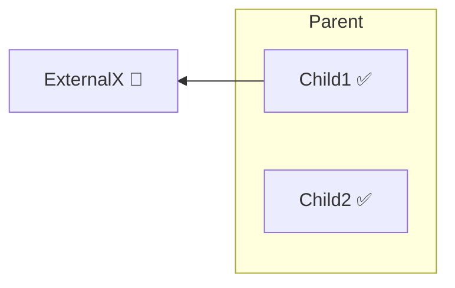
```mermaid
graph RL
    subgraph Parent
        Child1["Child1 ✅"]
        Child2["Child2 ✅"]
    end
    ExternalX["ExternalX 🚀"]

    Child1 --> ExternalX
```

**Decision Steps**:

1. `ExternalX` explicitly requested;
2. `Child1` depends on `ExternalX`, cascade enabled → `Child1` included (dependent of `ExternalX`);
3. `Parent` has child included due to external dependency, so `Parent` becomes substantive composite;
4. `Child2` is sibling of `Child1` in substantive composite, partial destruction disabled → `Child2` included.

**Destroy Phase**: `Child1`, `Child2`, `Parent`, `ExternalX`

### Example 14: Dependency Chain with Partial Destruction Enabled

**Test**: `should include dependency chain without forcing siblings when partial destruction enabled`

```mermaid
graph RL
    subgraph Parent
        Child1["Child1 ✅"]
        Child2["Child2 ✅"]
    end
    ExternalX["ExternalX 🚀"]

    Child1 --> ExternalX
```

**Options:**

- `allowPartialCompositeInstanceDestruction`: `true`

**Decision Steps**:

1. `ExternalX` explicitly requested;
2. `Child1` depends on `ExternalX`, cascade enabled → `Child1` included (dependent of `ExternalX`);
3. `Parent` has child included due to external dependency, so `Parent` becomes substantive composite;
4. `Child2` is sibling of `Child1` in substantive composite, partial destruction enabled → `Child2` excluded.

**Destroy Phase**: `Child1`, `Parent`, `ExternalX`

### Example 15: State-Only Dependent Missing from Model

**Test**: `should include state-only dependents when model instance is missing`

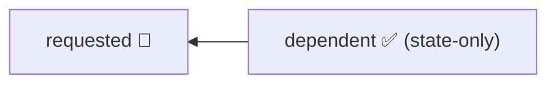
```mermaid
graph RL
    Requested["requested 🚀"]
    Dependent["dependent ✅ (state-only)"]

    Dependent --> Requested
```

**Decision Steps**:

1. `requested` explicitly requested;
2. `dependent` is not present in current project model, but exists in state with a dependency on `requested`;
3. destroy cascade uses state relationships, so `dependent` is included as dependent of destroyed `requested`.

**Destroy Phase**: `dependent`, `requested`
