# Refresh Phase Examples

**Legend:**

- `✅` = Up-to-date instance
- `≠` = Out-of-date instance
- `∅` = Non-deployed instance
- `❌` = Error instance
- `🚀` = Explicitly requested instance
- `👻` = Ghost instance (virtual)

### Example 1: Simple Refresh Request

**Test**: `should create refresh phase instead of update phase for refresh operations`

```mermaid
graph RL
    B["B 🚀≠"]
    A["A ✅"]

    B --> A
```

**Decision Steps**:

1. `B` explicitly requested for refresh;
2. `B` depends on `A`, `A` is up-to-date → `A` excluded.

**Refresh Phase**: `B`

### Example 2: Outdated Dependencies Ignored in Refresh

**Test**: `should not include outdated dependencies in refresh phase`

```mermaid
graph RL
    A["A ≠"]
    B["B ✅"]
    C["C 🚀"]

    C --> B --> A
```

**Decision Steps**:

1. `C` explicitly requested for refresh;
2. `C` depends on `B`, `B` is up-to-date → `B` excluded (no dependency propagation in refresh);
3. `B` depends on `A`, `A` is outdated → `A` excluded (not forced).

**Refresh Phase**: `C`

**Key Difference**: Unlike update operations, refresh does not automatically include outdated dependencies.

### Example 3: Ghost Children Ignored in Refresh

**Test**: `should not create destroy phase for refresh operations even with ghost children`

```mermaid
graph RL
    subgraph Parent["Parent 🚀"]
        Child["Child 👻"]
    end
```

**Decision Steps**:

1. `Parent` explicitly requested for refresh;
2. `Child` is ghost child of `Parent` → `Child` ignored (no destroy phase in refresh);
3. `Parent` has no non-ghost children needing update → no refresh phase created.

**Refresh Phase**: (none)

**Key Difference**: Unlike update operations, refresh operations do NOT create destroy phases for ghost cleanup.

### Example 4: Mixed Ghost and Normal Children

**Test**: `should handle composite with mixed ghost and normal children in refresh`

```mermaid
graph RL
    subgraph Parent["Parent 🚀"]
        GhostChild["GhostChild 👻"]
        NormalChild["NormalChild ≠"]
    end
```

**Decision Steps**:

1. `Parent` explicitly requested (substantive composite);
2. `NormalChild` is child of substantive composite, outdated → `NormalChild` included;
3. `GhostChild` is ghost child → ignored (no destroy phase in refresh).

**Refresh Phase**: `Parent`, `NormalChild`

### Example 5: Force Dependencies with Refresh

**Test**: `should handle forceUpdateDependencies with refresh operation`

```mermaid
graph RL
    A["A ✅"]
    B["B 🚀"]

    B --> A
```

**Options:**

- `forceUpdateDependencies`: `true`

**Decision Steps**:

1. `B` explicitly requested for refresh;
2. `B` depends on `A`, force flag enabled → `A` included.

**Refresh Phase**: `A`, `B`

### Example 6: Force Children with Refresh

**Test**: `should handle forceUpdateChildren with refresh operation`

```mermaid
graph RL
    subgraph Parent["Parent 🚀"]
        Child["Child ✅"]
    end
```

**Options:**

- `forceUpdateChildren`: `true`

**Decision Steps**:

1. `Parent` explicitly requested (substantive composite);
2. `Child` is child of substantive composite, force children enabled → `Child` included.

**Refresh Phase**: `Parent`, `Child`

### Example 7: Undeployed Dependencies Ignored in Refresh

**Test**: `should not include undeployed dependencies in refresh operation`

```mermaid
graph RL
    A["A ∅"]
    B["B 🚀"]

    B --> A
```

**Decision Steps**:

1. `B` explicitly requested for refresh;
2. `B` depends on `A`, `A` is undeployed (outdated) → `A` excluded (not forced).

**Refresh Phase**: `B`

### Example 8: Failed Dependencies Ignored in Refresh

**Test**: `should not include failed dependencies in refresh operation`

```mermaid
graph RL
    A["A ❌"]
    B["B 🚀"]

    B --> A
```

**Decision Steps**:

1. `B` explicitly requested for refresh;
2. `B` depends on `A`, `A` is failed (outdated) → `A` excluded (not forced).

**Refresh Phase**: `B`

### Example 9: Forced Dependencies in Refresh

**Test**: `should include outdated dependencies when forced in refresh operation`

```mermaid
graph RL
    A["A ≠"]
    B["B 🚀"]

    B --> A
```

**Options:**

- `forceUpdateDependencies`: `true`

**Decision Steps**:

1. `B` explicitly requested for refresh;
2. `B` depends on `A`, force dependencies enabled → `A` included.

**Refresh Phase**: `A`, `B`
