# Update Phase Examples

**Legend:**

- `✅` = Up-to-date instance
- `≠` = Out-of-date instance
- `∅` = Non-deployed instance
- `❌` = Error instance
- `🚀` = Explicitly requested instance
- `👻` = Ghost instance (virtual)

### Example 1: Simple Dependency Chain

**Test**: `should include out-of-date dependencies in linear chain`

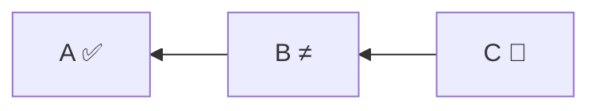
```mermaid
graph RL
    A["A ✅"]
    B["B ≠"]
    C["C 🚀"]

    C --> B --> A
```

**Decision Steps**:

1. `C` explicitly requested;
2. `C` depends on `B`, `B` is outdated → `B` included;
3. `B` depends on `A`, `A` is up-to-date → `A` excluded.

**Update Phase**: `B`, `C`

### Example 1a: Ignore Changed Dependencies Only

**Test**: `should skip only changed dependencies when ignoreChangedDependencies enabled`

```mermaid
graph RL
    A["A ✅"]
    B["B ≠"]
    C["C 🚀"]

    C --> B --> A
```

**Options:**

- `ignoreChangedDependencies`: `true`

**Decision Steps**:

1. `C` explicitly requested;
2. `C` depends on `B`, `B` is only changed and changed dependencies are ignored → `B` excluded;
3. no failed/undeployed prerequisite is present in this chain.

**Update Phase**: `C`

### Example 1b: Ignore Changed But Keep Undeployed/Failed

**Test**: `should still include undeployed dependencies when ignoreChangedDependencies enabled`

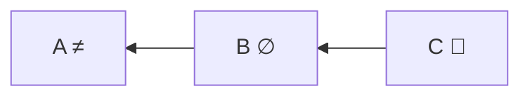
```mermaid
graph RL
    A["A ≠"]
    B["B ∅"]
    C["C 🚀"]

    C --> B --> A
```

**Options:**

- `ignoreChangedDependencies`: `true`

**Decision Steps**:

1. `C` explicitly requested;
2. `C` depends on `B`, `B` is undeployed → `B` included for safety;
3. `B` depends on `A`, `A` is only changed and changed dependencies are ignored → `A` excluded.

**Update Phase**: `B`, `C`

### Example 1c: Manual Ignore All Dependencies

**Test**: `should ignore all dependencies when ignoreDependencies enabled`

```mermaid
graph RL
    A["A ≠"]
    B["B ∅"]
    C["C 🚀"]

    C --> B --> A
```

**Options:**

- `ignoreDependencies`: `true`

**Decision Steps**:

1. `C` explicitly requested;
2. `C` dependencies are fully ignored in manual mode;
3. both changed and undeployed prerequisites are skipped.

**Update Phase**: `C`

### Example 2: Full Ancestor Chain for Compositional Inclusion

**Test**: `should include full ancestor chain for compositional inclusion`

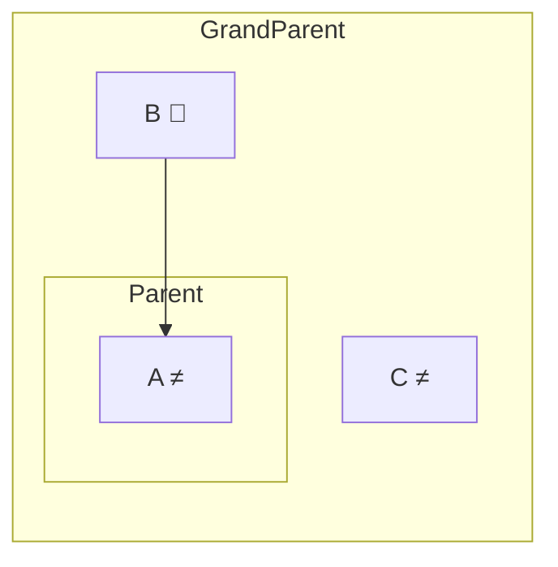
```mermaid
graph RL
    subgraph GrandParent
        subgraph Parent
            A["A ≠"]
        end
        B["B 🚀"]
        C["C ≠"]
    end

    B --> A
```

**Decision Steps**:

1. `B` explicitly requested;
2. `B` depends on `A`, `A` is outdated → `A` included;
3. `A` is child of `Parent` → `Parent` included (compositional);
4. `Parent` is child of `GrandParent` → `GrandParent` included as ancestor;
5. `C` is sibling of `Parent`, but ancestor inclusion does not auto-include siblings → `C` NOT included.

**Update Phase**: `A`, `Parent`, `GrandParent`, `B`

### Example 3: Force Dependencies

**Test**: `should force all dependencies when flag enabled`

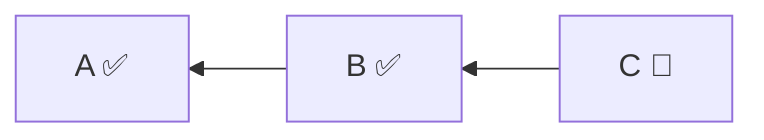
```mermaid
graph RL
    A["A ✅"]
    B["B ✅"]
    C["C 🚀"]

    C --> B --> A
```

**Options:**

- `forceUpdateDependencies`: `true`

**Decision Steps**:

1. `C` explicitly requested;
2. `C` depends on `B`, force flag enabled → `B` included;
3. `B` depends on `A`, force flag enabled → `A` included.

**Update Phase**: `A`, `B`, `C`

### Example 4: Substantive Composite with Mixed Child States

**Test**: `should include outdated children of substantive composite`

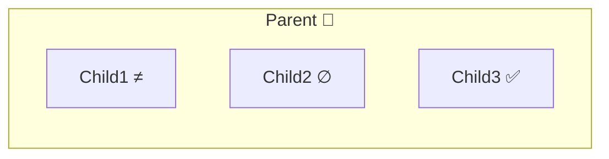
```mermaid
graph RL
    subgraph Parent["Parent 🚀"]
        Child1["Child1 ≠"]
        Child2["Child2 ∅"]
        Child3["Child3 ✅"]
    end
```

**Decision Steps**:

1. `Parent` explicitly requested (substantive composite);
2. `Child1` is child of substantive composite, outdated → `Child1` included;
3. `Child2` is child of substantive composite, outdated → `Child2` included;
4. `Child3` is child of substantive composite, up-to-date → `Child3` excluded.

**Update Phase**: `Child1`, `Child2`, `Parent`

### Example 5: Ghost Cleanup During Update

**Test**: `should cleanup ghost children during composite update`

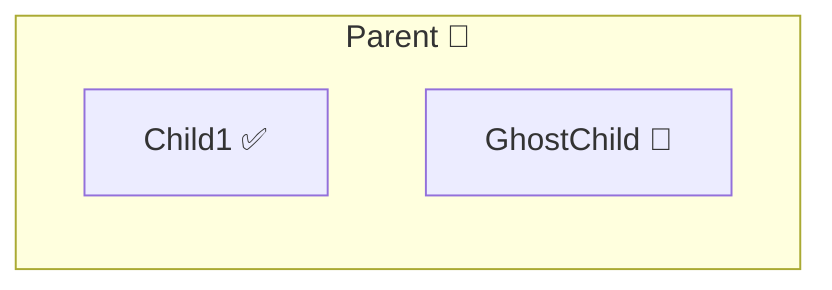
```mermaid
graph RL
    subgraph Parent["Parent 🚀"]
        Child1["Child1 ✅"]
        GhostChild["GhostChild 👻"]
    end
```

**Decision Steps**:

1. `Parent` explicitly requested (substantive composite), but will not be added to update phase as all real children are up-to-date;
2. `GhostChild` is ghost child of `Parent` → `GhostChild` added to destroy phase;
3. `Parent` has destroyed children → `Parent` added to destroy phase.

**Destroy Phase**: `GhostChild`, `Parent`

### Example 5a: Force Children With Ghost-Only Composite

**Test**: `should cleanup ghost children when forceUpdateChildren is enabled`

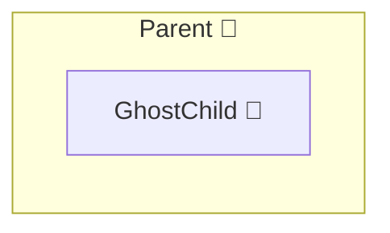
```mermaid
graph RL
    subgraph Parent["Parent 🚀"]
        GhostChild["GhostChild 👻"]
    end
```

**Options:**

- `forceUpdateChildren`: `true`

**Decision Steps**:

1. `Parent` explicitly requested;
2. `forceUpdateChildren` applies to real children only, so `GhostChild` is not included in update phase;
3. `Parent` has no non-ghost child that needs update, so update phase stays empty;
4. ghost cleanup pass includes `GhostChild` in destroy phase;
5. `Parent` is added to destroy phase as parent of destroyed ghost child.

**Destroy Phase**: `GhostChild`, `Parent`

### Example 5b: Nested Ghost Cleanup for Child Composites

**Test**: `should cleanup ghosts from nested child composites during parent composite update`

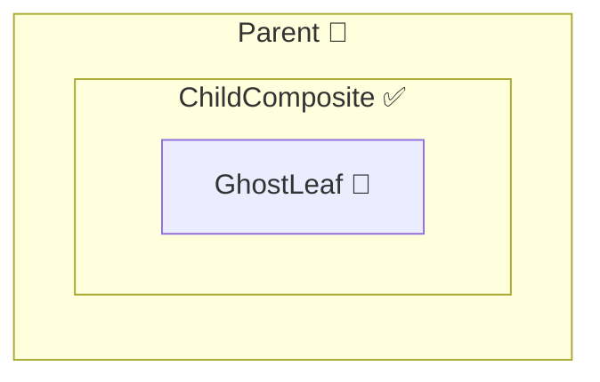
```mermaid
graph RL
    subgraph Parent["Parent 🚀"]
        subgraph ChildComposite["ChildComposite ✅"]
            GhostLeaf["GhostLeaf 👻"]
        end
    end
```

**Decision Steps**:

1. `Parent` explicitly requested;
2. no non-ghost outdated descendants exist, so update phase is empty;
3. ghost cleanup traverses the full composite subtree, not only direct children;
4. nested `GhostLeaf` is included in destroy phase;
5. intermediate composite chain needed for state recalculation is included, so `ChildComposite` and `Parent` are also added to destroy phase.

**Destroy Phase**: `GhostLeaf`, `ChildComposite`, `Parent`

### Example 5c: Only Destroy Ghosts

**Test**: `should run only ghost destroy phase when onlyDestroyGhosts is enabled`

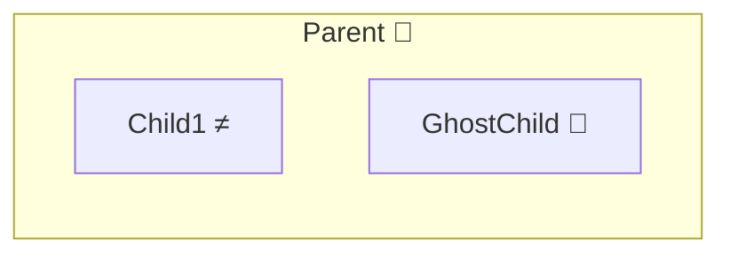
```mermaid
graph RL
    subgraph Parent["Parent 🚀"]
        Child1["Child1 ≠"]
        GhostChild["GhostChild 👻"]
    end
```

**Options:**

- `onlyDestroyGhosts`: `true`

**Decision Steps**:

1. `Parent` explicitly requested;
2. `Child1` is outdated and would normally be included in update phase;
3. `onlyDestroyGhosts` disables update phase generation entirely;
4. ghost cleanup still runs and includes `GhostChild`;
5. `Parent` is included in destroy phase as parent of destroyed ghost child.

**Destroy Phase**: `GhostChild`, `Parent`

### Example 5d: Destroy Ghosts Before Update

**Test**: `should place ghost destroy phase before update when firstDestroyGhosts is enabled`

```mermaid
graph RL
    subgraph Parent["Parent 🚀"]
        Child1["Child1 ≠"]
        GhostChild["GhostChild 👻"]
    end
```

**Options:**

- `firstDestroyGhosts`: `true`

**Decision Steps**:

1. `Parent` explicitly requested;
2. `Child1` is outdated and included in update phase;
3. `GhostChild` is included in ghost cleanup destroy phase;
4. option reorders phases so destroy runs before update;
5. both phases are kept.

**Destroy Phase**: `GhostChild`, `Parent`

**Update Phase**: `Child1`, `Parent`

### Example 5e: Ignore Ghost Cleanup

**Test**: `should skip ghost destroy phase when ignoreGhosts is enabled`

```mermaid
graph RL
    subgraph Parent["Parent 🚀"]
        Child1["Child1 ≠"]
        GhostChild["GhostChild 👻"]
    end
```

**Options:**

- `ignoreGhosts`: `true`

**Decision Steps**:

1. `Parent` explicitly requested;
2. `Child1` is outdated and included in update phase;
3. ghost cleanup generation is disabled by `ignoreGhosts`;
4. no destroy phase is created for ghosts.

**Update Phase**: `Child1`, `Parent`

### Example 5f: Mutually Exclusive Ghost Strategy Options

**Test**: `should reject mutually exclusive ghost options`

```mermaid
graph RL
    subgraph Parent["Parent 🚀"]
        GhostChild["GhostChild 👻"]
    end
```

**Options:**

- `onlyDestroyGhosts`: `true`
- `ignoreGhosts`: `true`

**Decision Steps**:

1. planner validates ghost strategy options before phase construction;
2. more than one of `onlyDestroyGhosts`, `firstDestroyGhosts`, `ignoreGhosts` is enabled;
3. operation plan creation is rejected as invalid.

**Result**: validation error

### Example 6: Nested Composites with Mixed Updates

**Test**: `should handle complex nested hierarchy correctly`

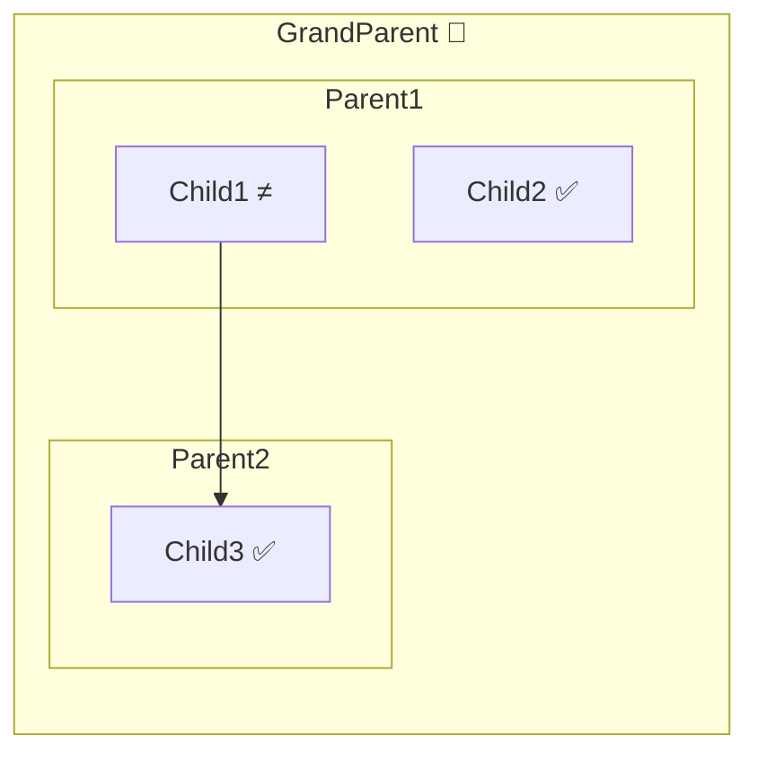
```mermaid
graph RL
    subgraph GrandParent["GrandParent 🚀"]
        subgraph Parent1
            Child1["Child1 ≠"]
            Child2["Child2 ✅"]
        end
        subgraph Parent2
            Child3["Child3 ✅"]
        end
    end

    Child1 --> Child3
```

**Decision Steps**:

1. `GrandParent` explicitly requested (substantive composite);
2. `Child1` is child of substantive composite, outdated → `Child1` included;
3. `Child1` depends on `Child3`, `Child3` up-to-date → `Child3` excluded;
4. `Child1` is child of `Parent1` → `Parent1` included (compositional);
5. `Parent1` is child of `GrandParent` → already included.

**Update Phase**: `Child1`, `Parent1`, `GrandParent`

### Example 7: Request Child with Isolated Update

**Test**: `should not include siblings when child explicitly requested (isolated update)`

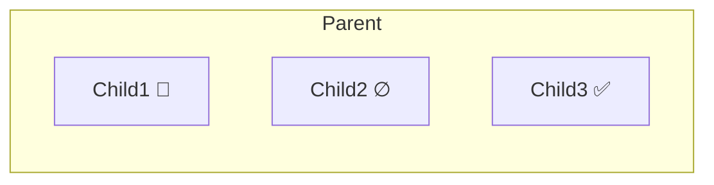
```mermaid
graph RL
    subgraph Parent
        Child1["Child1 🚀"]
        Child2["Child2 ∅"]
        Child3["Child3 ✅"]
    end
```

**Decision Steps**:

1. `Child1` explicitly requested;
2. `Child1` is child of `Parent` → `Parent` included (compositional);
3. `Child2` is child of compositional composite → `Child2` NOT included (rule 3 doesn't apply);
4. `Child3` is child of compositional composite → `Child3` NOT included (rule 3 doesn't apply).

**Update Phase**: `Child1`, `Parent`

### Example 8: Force Children Flag

**Test**: `should force all children when flag enabled`

```mermaid
graph RL
    subgraph Parent["Parent 🚀"]
        Child1["Child1 ≠"]
        Child2["Child2 ∅"]
        Child3["Child3 ✅"]
    end
```

**Options:**

- `forceUpdateChildren`: `true`

**Decision Steps**:

1. `Parent` explicitly requested (substantive composite);
2. `Child1` is child of substantive composite, force children enabled → `Child1` included;
3. `Child2` is child of substantive composite, force children enabled → `Child2` included;
4. `Child3` is child of substantive composite, force children enabled → `Child3` included.

**Update Phase**: `Child1`, `Child2`, `Child3`, `Parent`

### Example 9: Error State Recovery

**Test**: `should include instances with error status for recovery`

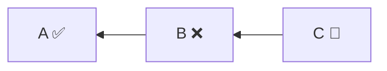
```mermaid
graph RL
    A["A ✅"]
    B["B ❌"]
    C["C 🚀"]

    C --> B --> A
```

**Decision Steps**:

1. `C` explicitly requested;
2. `C` depends on `B`, `B` is outdated (failed) → `B` included;
3. `B` depends on `A`, `A` is up-to-date → `A` excluded.

**Update Phase**: `B`, `C`

### Example 10: Cross-Composite Dependencies

**Test**: `should handle dependencies crossing composite boundaries`

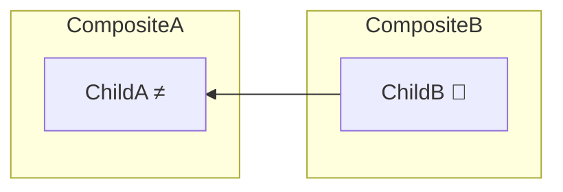
```mermaid
graph RL
    subgraph CompositeA
        ChildA["ChildA ≠"]
    end
    subgraph CompositeB
        ChildB["ChildB 🚀"]
    end

    ChildB --> ChildA
```

**Decision Steps**:

1. `ChildB` explicitly requested;
2. `ChildB` depends on `ChildA`, `ChildA` is outdated → `ChildA` included;
3. `ChildB` is child of `CompositeB` → `CompositeB` included (compositional);
4. `ChildA` is child of `CompositeA`, included due to external dependency → `CompositeA` included (substantive).

**Update Phase**: `ChildA`, `CompositeA`, `ChildB`, `CompositeB`

### Example 11: Unrelated Instance Isolation

**Test**: `should not include unrelated instances even if they depend on updated instance`

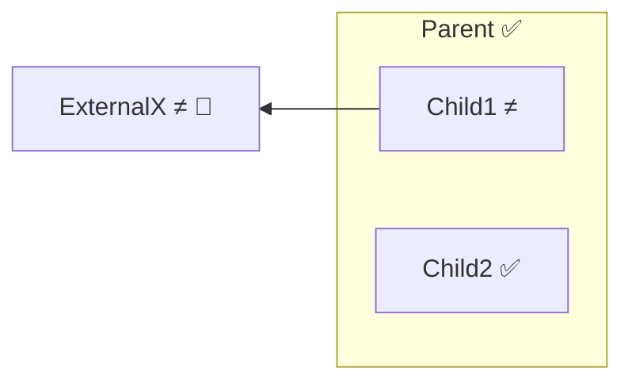
```mermaid
graph RL
    subgraph Parent["Parent ✅"]
        Child1["Child1 ≠"]
        Child2["Child2 ✅"]
    end
    ExternalX["ExternalX ≠ 🚀"]

    Child1 --> ExternalX
```

**Decision Steps**:

1. `ExternalX` explicitly requested;
2. no instances depend on `ExternalX` (`Child1` depends on `ExternalX`, not vice versa);
3. `Child1` is not explicitly requested, not a dependency of `ExternalX`, not a child of substantive composite;
4. `Parent` and its children remain unaffected.

**Update Phase**: `ExternalX`

### Example 12: Multiple Explicit Requests

**Test**: `should handle multiple explicit requests with overlapping dependencies`

```mermaid
graph RL
    A["A 🚀"]
    B["B ✅"]
    C["C 🚀"]

    C --> B --> A
```

**Decision Steps**:

1. `A` explicitly requested;
2. `C` explicitly requested;
3. `C` depends on `B`, `B` is up-to-date → `B` excluded;
4. `B` depends on `A`, `A` already included → no change.

**Update Phase**: `A`, `C`

### Example 13: Deep Nesting with Ancestor Chain Inclusion

**Test**: `should include deep ancestor chain without ancestor siblings`

```mermaid
graph RL
    subgraph GreatGrandParent
        subgraph GrandParent
            subgraph Parent
                Child["Child 🚀"]
            end
            Uncle["Uncle ✅"]
        end
        GreatUncle["GreatUncle ✅"]
    end
```

**Decision Steps**:

1. `Child` explicitly requested;
2. `Child` is child of `Parent` → `Parent` included (compositional);
3. `Parent` is child of `GrandParent` → `GrandParent` included as ancestor;
4. `GrandParent` is child of `GreatGrandParent` → `GreatGrandParent` included as ancestor;
5. `Uncle` and `GreatUncle` are ancestor siblings and are not auto-included.

**Update Phase**: `Child`, `Parent`, `GrandParent`, `GreatGrandParent`

### Example 14: Mixed Force Flags

**Test**: `should handle both force flags enabled together`

```mermaid
graph RL
    A["A ✅"]
    B["B ✅"]
    C["C 🚀"]
    subgraph Parent["Parent ✅"]
        Child1["Child1 ✅"]
        Child2["Child2 ✅"]
    end

    C --> B --> A
    C --> Child1
```

**Options:**

- `forceUpdateDependencies`: `true`
- `forceUpdateChildren`: `true`

**Decision Steps**:

1. `C` explicitly requested;
2. `C` depends on `B`, force dependencies enabled → `B` included;
3. `B` depends on `A`, force dependencies enabled → `A` included;
4. `C` depends on `Child1`, force dependencies enabled → `Child1` included;
5. `Child1` is child of `Parent` → `Parent` becomes substantive composite (has child included due to external dependency);
6. `Child2` is child of substantive composite, force children enabled → `Child2` included.

**Update Phase**: `A`, `B`, `Child1`, `Child2`, `Parent`, `C`

### Example 15: Diamond Dependency Pattern

**Test**: `should handle diamond dependency correctly`

```mermaid
graph RL
    A["A ✅"]
    B["B ≠"]
    C["C ≠"]
    D["D 🚀"]

    D --> B
    D --> C
    B --> A
    C --> A
```

**Decision Steps**:

1. `D` explicitly requested;
2. `D` depends on `B`, `B` is outdated → `B` included;
3. `D` depends on `C`, `C` is outdated → `C` included;
4. `B` depends on `A`, `A` is up-to-date → `A` excluded;
5. `C` depends on `A`, `A` is up-to-date → `A` excluded (already evaluated).

**Update Phase**: `B`, `C`, `D`

### Example 16: Mixed Ghost and Real Children

**Test**: `should handle composite with both ghost and real children`

```mermaid
graph RL
    subgraph Parent["Parent 🚀"]
        Child1["Child1 ≠"]
        Child2["Child2 ✅"]
        GhostChild["GhostChild 👻"]
    end
```

**Decision Steps**:

1. `Parent` explicitly requested (substantive composite);
2. `Child1` is child of substantive composite, outdated → `Child1` included;
3. `Child2` is child of substantive composite, up-to-date → `Child2` excluded;
4. `GhostChild` is ghost child of `Parent` → `GhostChild` added to destroy phase;
5. `Parent` has destroyed children → `Parent` added to destroy phase.

**Update Phase**: `Child1`, `Parent`

**Destroy Phase**: `GhostChild`, `Parent`

### Example 17: Dependency Chain with Partial Update Disabled

**Test**: `should include dependency chain and force siblings when partial update disabled`

```mermaid
graph RL
    subgraph Parent["Parent ✅"]
        Child1["Child1 ≠"]
        Child2["Child2 ≠"]
    end
    ExternalX["ExternalX 🚀"]

    ExternalX --> Child1
```

**Decision Steps**:

1. `ExternalX` explicitly requested;
2. `ExternalX` depends on `Child1`, `Child1` is outdated → `Child1` included;
3. `Parent` has child included due to external dependency, so `Parent` becomes substantive composite;
4. `Child2` is child of substantive composite, outdated and partial update disabled → `Child2` included.

**Update Phase**: `Child1`, `Child2`, `Parent`, `ExternalX`

### Example 18: Dependency Chain with Partial Update Enabled

**Test**: `should include dependency chain without forcing siblings when partial update enabled`

```mermaid
graph RL
    subgraph Parent["Parent ✅"]
        Child1["Child1 ≠"]
        Child2["Child2 ≠"]
    end
    ExternalX["ExternalX 🚀"]

    ExternalX --> Child1
```

**Options:**

- `allowPartialCompositeInstanceUpdate`: `true`

**Decision Steps**:

1. `ExternalX` explicitly requested;
2. `ExternalX` depends on `Child1`, `Child1` is outdated → `Child1` included;
3. `Parent` has child included due to external dependency, so `Parent` becomes substantive composite;
4. `Child2` is child of substantive composite, outdated but partial update enabled → `Child2` excluded.

**Update Phase**: `Child1`, `Parent`, `ExternalX`

### Example 19: Child Dependencies with Compositional Parent

**Test**: `should include child dependencies when child explicitly requested`

```mermaid
graph RL
    subgraph Parent
        Child1["Child1 ≠"]
        Child2["Child2 🚀≠"]
        Child3["Child3 ≠"]
        Child4["Child4 ≠"]
    end

    Child2 --> Child1
    Child3 --> Child4
```

**Decision Steps**:

1. `Child2` explicitly requested (outdated);
2. `Child2` depends on `Child1`, `Child1` is outdated → `Child1` included;
3. `Child2` is child of `Parent` → `Parent` included (compositional, since `Child1` is internal dependency);
4. `Child3` is child of compositional composite, outdated → `Child3` excluded (rule 3 doesn't apply);
5. `Child4` is child of compositional composite, outdated → `Child4` excluded (rule 3 doesn't apply).

**Update Phase**: `Child1`, `Child2`, `Parent`

### Example 20: Explicit Empty Nested Composite

**Test**: `should skip explicitly requested empty nested composites`

```mermaid
graph RL
    subgraph Root["Root 🚀"]
        subgraph Level1["Level1 ✅"]
            Level2["Level2 ✅"]
        end
    end
```

**Decision Steps**:

1. `Root` explicitly requested;
2. `Root` has no unit descendants (directly or recursively) → empty composite;
3. empty composites are not added to operation plan;
4. `Level1` and `Level2` are also empty composites and remain excluded.

**Update Phase**: _(empty)_

### Example 21: Mixed Nested Branches with Empty Composite Pruning

**Test**: `should keep non-empty branch while skipping empty nested composites`

```mermaid
graph RL
    subgraph Root["Root 🚀"]
        subgraph EmptyLevel1
            EmptyLevel2["EmptyLevel2 ✅"]
        end
        subgraph NonEmptyLevel1
            Leaf["Leaf ≠"]
        end
    end
```

**Decision Steps**:

1. `Root` explicitly requested;
2. `EmptyLevel1`/`EmptyLevel2` have no unit descendants → both excluded;
3. `Leaf` is outdated and is a unit descendant under `NonEmptyLevel1` → `Leaf` included;
4. `NonEmptyLevel1` is parent of included child → `NonEmptyLevel1` included;
5. `Root` is explicitly requested and non-empty due to `Leaf` branch → `Root` included.

**Update Phase**: `Root`, `Leaf`, `NonEmptyLevel1`
