# Update Phase Examples

**Legend:**

- `✅` = Up-to-date instance
- `≠` = Out-of-date instance
- `∅` = Non-deployed instance
- `❌` = Error instance
- `🚀` = Explicitly requested instance
- `👻` = Ghost instance (virtual)

### Example 1: Simple Dependency Chain

**Test**: `should include out-of-date dependencies in linear chain`

```mermaid
graph RL
    A["A ✅"]
    B["B ≠"]
    C["C 🚀"]

    C --> B --> A
```

**Decision Steps**:

1. `C` explicitly requested;
2. `C` depends on `B`, `B` is outdated → `B` included;
3. `B` depends on `A`, `A` is up-to-date → `A` excluded.

**Update Phase**: `B`, `C`

### Example 2: Composite Boundary Isolation

**Test**: `should not propagate beyond compositional inclusion`

```mermaid
graph RL
    subgraph GrandParent
        subgraph Parent
            A["A ≠"]
        end
        B["B 🚀"]
        C["C ≠"]
    end

    B --> A
```

**Decision Steps**:

1. `B` explicitly requested;
2. `B` depends on `A`, `A` is outdated → `A` included;
3. `A` is child of `Parent` → `Parent` included (compositional);
4. `Parent` is child of `GrandParent` → `GrandParent` NOT included (compositional boundary);
5. `C` is sibling of `Parent`, `C` is outdated but `GrandParent` is not included → `C` NOT included.

**Update Phase**: `A`, `Parent`, `B`

### Example 3: Force Dependencies

**Test**: `should force all dependencies when flag enabled`

```mermaid
graph RL
    A["A ✅"]
    B["B ✅"]
    C["C 🚀"]

    C --> B --> A
```

**Options:**

- `forceUpdateDependencies`: `true`

**Decision Steps**:

1. `C` explicitly requested;
2. `C` depends on `B`, force flag enabled → `B` included;
3. `B` depends on `A`, force flag enabled → `A` included.

**Update Phase**: `A`, `B`, `C`

### Example 4: Substantive Composite with Mixed Child States

**Test**: `should include outdated children of substantive composite`

```mermaid
graph RL
    subgraph Parent["Parent 🚀"]
        Child1["Child1 ≠"]
        Child2["Child2 ∅"]
        Child3["Child3 ✅"]
    end
```

**Decision Steps**:

1. `Parent` explicitly requested (substantive composite);
2. `Child1` is child of substantive composite, outdated → `Child1` included;
3. `Child2` is child of substantive composite, outdated → `Child2` included;
4. `Child3` is child of substantive composite, up-to-date → `Child3` excluded.

**Update Phase**: `Child1`, `Child2`, `Parent`

### Example 5: Ghost Cleanup During Update

**Test**: `should cleanup ghost children during composite update`

```mermaid
graph RL
    subgraph Parent["Parent 🚀"]
        Child1["Child1 ✅"]
        GhostChild["GhostChild 👻"]
    end
```

**Decision Steps**:

1. `Parent` explicitly requested (substantive composite), but will not be added to update phase as all real children are up-to-date;
2. `GhostChild` is ghost child of `Parent` → `GhostChild` added to destroy phase;
3. `Parent` has destroyed children → `Parent` added to destroy phase.

**Destroy Phase**: `GhostChild`, `Parent`

### Example 6: Nested Composites with Mixed Updates

**Test**: `should handle complex nested hierarchy correctly`

**Decision Steps**:

1. `GrandParent` explicitly requested (substantive composite);
2. `Child1` is child of substantive composite, outdated → `Child1` included;
3. `Child1` depends on `Child3`, `Child3` up-to-date → `Child3` excluded;
4. `Child1` is child of `Parent1` → `Parent1` included (compositional);
5. `Parent1` is child of `GrandParent` → already included.

**Update Phase**: `Child1`, `Parent1`, `GrandParent`

### Example 7: Request Child with Isolated Update

**Test**: `should not include siblings when child explicitly requested (isolated update)`

```mermaid
graph RL
    subgraph Parent
        Child1["Child1 🚀"]
        Child2["Child2 ∅"]
        Child3["Child3 ✅"]
    end
```

**Decision Steps**:

1. `Child1` explicitly requested;
2. `Child1` is child of `Parent` → `Parent` included (compositional);
3. `Child2` is child of compositional composite → `Child2` NOT included (rule 3 doesn't apply);
4. `Child3` is child of compositional composite → `Child3` NOT included (rule 3 doesn't apply).

**Update Phase**: `Child1`, `Parent`

### Example 8: Force Children Flag

**Test**: `should force all children when flag enabled`

**Options:**

- `forceUpdateChildren`: `true`

**Decision Steps**:

1. `Parent` explicitly requested (substantive composite);
2. `Child1` is child of substantive composite, force children enabled → `Child1` included;
3. `Child2` is child of substantive composite, force children enabled → `Child2` included;
4. `Child3` is child of substantive composite, force children enabled → `Child3` included.

**Update Phase**: `Child1`, `Child2`, `Child3`, `Parent`

### Example 9: Error State Recovery

**Test**: `should include instances with error status for recovery`

```mermaid
graph RL
    A["A ✅"]
    B["B ❌"]
    C["C 🚀"]

    C --> B --> A
```

**Decision Steps**:

1. `C` explicitly requested;
2. `C` depends on `B`, `B` is outdated (failed) → `B` included;
3. `B` depends on `A`, `A` is up-to-date → `A` excluded.

**Update Phase**: `B`, `C`

### Example 10: Cross-Composite Dependencies

**Test**: `should handle dependencies crossing composite boundaries`

```mermaid
graph RL
    subgraph CompositeA
        ChildA["ChildA ≠"]
    end
    subgraph CompositeB
        ChildB["ChildB 🚀"]
    end

    ChildB --> ChildA
```

**Decision Steps**:

1. `ChildB` explicitly requested;
2. `ChildB` depends on `ChildA`, `ChildA` is outdated → `ChildA` included;
3. `ChildB` is child of `CompositeB` → `CompositeB` included (compositional);
4. `ChildA` is child of `CompositeA`, included due to external dependency → `CompositeA` included (substantive).

**Update Phase**: `ChildA`, `CompositeA`, `ChildB`, `CompositeB`

### Example 11: Unrelated Instance Isolation

**Test**: `should not include unrelated instances even if they depend on updated instance`

```mermaid
graph RL
    subgraph Parent["Parent ✅"]
        Child1["Child1 ≠"]
        Child2["Child2 ✅"]
    end
    ExternalX["ExternalX ≠ 🚀"]

    Child1 --> ExternalX
```

**Decision Steps**:

1. `ExternalX` explicitly requested;
2. no instances depend on `ExternalX` (`Child1` depends on `ExternalX`, not vice versa);
3. `Child1` is not explicitly requested, not a dependency of `ExternalX`, not a child of substantive composite;
4. `Parent` and its children remain unaffected.

**Update Phase**: `ExternalX`

### Example 12: Multiple Explicit Requests

**Test**: `should handle multiple explicit requests with overlapping dependencies`

```mermaid
graph RL
    A["A 🚀"]
    B["B ✅"]
    C["C 🚀"]

    C --> B --> A
```

**Decision Steps**:

1. `A` explicitly requested;
2. `C` explicitly requested;
3. `C` depends on `B`, `B` is up-to-date → `B` excluded;
4. `B` depends on `A`, `A` already included → no change.

**Update Phase**: `A`, `C`

### Example 13: Deep Nesting with Boundary Isolation

**Test**: `should isolate boundaries in deep composite hierarchies`

```mermaid
graph RL
    subgraph GreatGrandParent
        subgraph GrandParent
            subgraph Parent
                Child["Child 🚀"]
            end
            Uncle["Uncle ✅"]
        end
        GreatUncle["GreatUncle ✅"]
    end
```

**Decision Steps**:

1. `Child` explicitly requested;
2. `Child` is child of `Parent` → `Parent` included (compositional);
3. `Parent` is child of `GrandParent` → `GrandParent` NOT included (compositional boundary);
4. `Uncle` and `GreatUncle` not affected.

**Update Phase**: `Child`, `Parent`

### Example 14: Mixed Force Flags

**Test**: `should handle both force flags enabled together`

```mermaid
graph RL
    A["A ✅"]
    B["B ✅"]
    C["C 🚀"]
    subgraph Parent["Parent ✅"]
        Child1["Child1 ✅"]
        Child2["Child2 ✅"]
    end

    C --> B --> A
    C --> Child1
```

**Options:**

- `forceUpdateDependencies`: `true`
- `forceUpdateChildren`: `true`

**Decision Steps**:

1. `C` explicitly requested;
2. `C` depends on `B`, force dependencies enabled → `B` included;
3. `B` depends on `A`, force dependencies enabled → `A` included;
4. `C` depends on `Child1`, force dependencies enabled → `Child1` included;
5. `Child1` is child of `Parent` → `Parent` becomes substantive composite (has child included due to external dependency);
6. `Child2` is child of substantive composite, force children enabled → `Child2` included.

**Update Phase**: `A`, `B`, `Child1`, `Child2`, `Parent`, `C`

### Example 15: Diamond Dependency Pattern

**Test**: `should handle diamond dependency correctly`

```mermaid
graph RL
    A["A ✅"]
    B["B ≠"]
    C["C ≠"]
    D["D 🚀"]

    D --> B
    D --> C
    B --> A
    C --> A
```

**Decision Steps**:

1. `D` explicitly requested;
2. `D` depends on `B`, `B` is outdated → `B` included;
3. `D` depends on `C`, `C` is outdated → `C` included;
4. `B` depends on `A`, `A` is up-to-date → `A` excluded;
5. `C` depends on `A`, `A` is up-to-date → `A` excluded (already evaluated).

**Update Phase**: `B`, `C`, `D`

### Example 16: Mixed Ghost and Real Children

**Test**: `should handle composite with both ghost and real children`

```mermaid
graph RL
    subgraph Parent["Parent 🚀"]
        Child1["Child1 ≠"]
        Child2["Child2 ✅"]
        GhostChild["GhostChild 👻"]
    end
```

**Decision Steps**:

1. `Parent` explicitly requested (substantive composite);
2. `Child1` is child of substantive composite, outdated → `Child1` included;
3. `Child2` is child of substantive composite, up-to-date → `Child2` excluded;
4. `GhostChild` is ghost child of `Parent` → `GhostChild` added to destroy phase;
5. `Parent` has destroyed children → `Parent` added to destroy phase.

**Update Phase**: `Child1`, `Parent`

**Destroy Phase**: `GhostChild`, `Parent`

### Example 17: Dependency Chain with Partial Update Disabled

**Test**: `should include dependency chain and force siblings when partial update disabled`

```mermaid
graph RL
    subgraph Parent["Parent ✅"]
        Child1["Child1 ≠"]
        Child2["Child2 ≠"]
    end
    ExternalX["ExternalX 🚀"]

    ExternalX --> Child1
```

**Decision Steps**:

1. `ExternalX` explicitly requested;
2. `ExternalX` depends on `Child1`, `Child1` is outdated → `Child1` included;
3. `Parent` has child included due to external dependency, so `Parent` becomes substantive composite;
4. `Child2` is child of substantive composite, outdated and partial update disabled → `Child2` included.

**Update Phase**: `Child1`, `Child2`, `Parent`, `ExternalX`

### Example 18: Dependency Chain with Partial Update Enabled

**Test**: `should include dependency chain without forcing siblings when partial update enabled`

**Options:**

- `allowPartialCompositeInstanceUpdate`: `true`

**Decision Steps**:

1. `ExternalX` explicitly requested;
2. `ExternalX` depends on `Child1`, `Child1` is outdated → `Child1` included;
3. `Parent` has child included due to external dependency, so `Parent` becomes substantive composite;
4. `Child2` is child of substantive composite, outdated but partial update enabled → `Child2` excluded.

**Update Phase**: `Child1`, `Parent`, `ExternalX`

### Example 19: Child Dependencies with Compositional Parent

**Test**: `should include child dependencies when child explicitly requested`

```mermaid
graph RL
    subgraph Parent
        Child1["Child1 ≠"]
        Child2["Child2 🚀≠"]
        Child3["Child3 ≠"]
        Child4["Child4 ≠"]
    end
    
    Child2 --> Child1
    Child3 --> Child4
```

**Decision Steps**:

1. `Child2` explicitly requested (outdated);
2. `Child2` depends on `Child1`, `Child1` is outdated → `Child1` included;
3. `Child2` is child of `Parent` → `Parent` included (compositional, since `Child1` is internal dependency);
4. `Child3` is child of compositional composite, outdated → `Child3` excluded (rule 3 doesn't apply);
5. `Child4` is child of compositional composite, outdated → `Child4` excluded (rule 3 doesn't apply).

**Update Phase**: `Child1`, `Child2`, `Parent`
